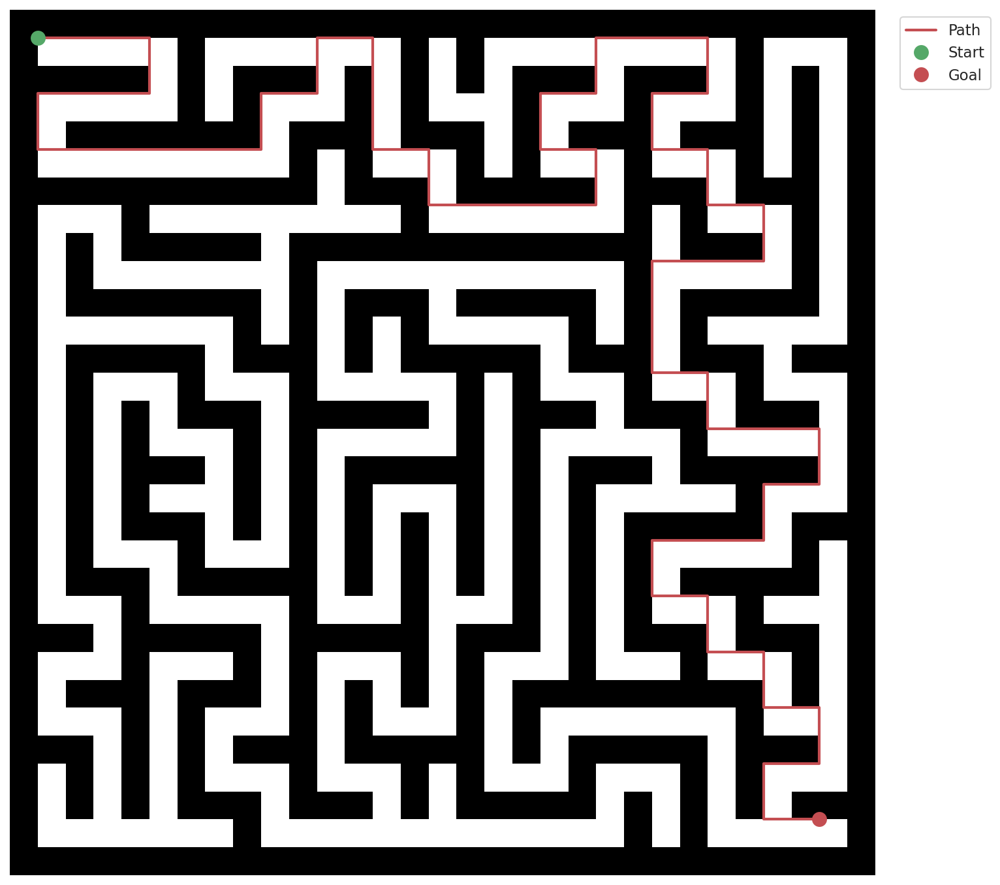
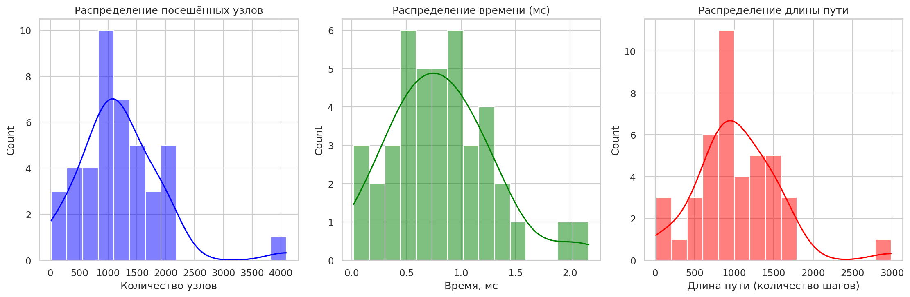
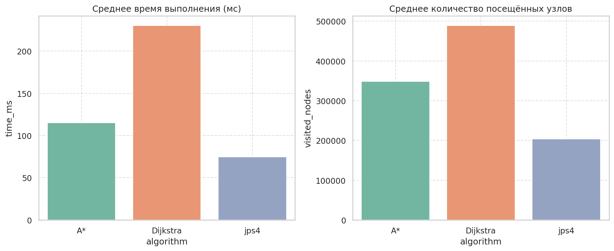
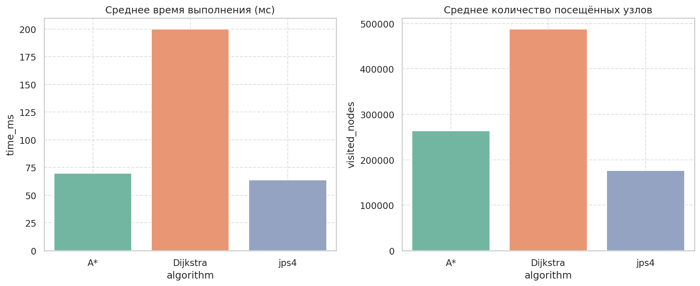

# Algorithms for finding the way in a maze

## Introduction
The **concept of a maze** appeared a long time ago, originally a maze was an ordinary field bounded by walls, which also had obstacles. However, with the advent of the need to work with maps, systems, as well as, in general, with the advent of the task of building a path, mazes began to be considered in a broader sense. In the modern world, the task of finding a way through a maze is one of the **most popular** in various fields, ranging from **navigation** to **direct integration for the Internet**.
## JPS4 – Jump Point Search for 4‑Directional Grids

The JPS4 algorithm was chosen as the algorithm for implementation. It is an adaptation of the classic Jump Point Search (JPS) algorithm that works on grids with **4‑way movement** (up, down, left, right). The algorithm guarantees optimal shortest paths while drastically reducing the number of nodes visited during search compared to **A***.

The repository includes:
- A fast C++ implementation of JPS4.
- A* and Dijkstra implementation and comparison testing
- Python scripts for maze generation, batch testing, visualisation, and benchmark statistics.

---

## Algorithm Overview

### The problem with A* on grids
A* explores many symmetric paths when moving through open spaces. In a long corridor it examines **every** cell, even though the optimal direction is obvious. This leads to high memory and time consumption.

### How JPS4 works
JPS4 exploits the idea of **jump points** – cells where the optimal path must change direction (**forced neighbours**) or where the goal is reached. Instead of expanding every neighbour, the algorithm recursively “jumps” along a straight line until it finds:

1. a wall or grid border,
2. the goal,
3. a cell with a **forced neighbour** (a turn forced by an obstacle).

Only those jump points are inserted into the open set. All intermediate cells are skipped, which dramatically reduces the number of visited nodes while preserving optimality.

### Formal characteristics of algorithm
- **Optimal**: finds the shortest path (in terms of number of steps) if one exists.
- **Complete**: always terminates and returns a path when reachable.
- **Time complexity**: significantly better than A* on grids with many long straight corridors.
- **Space complexity**: proportional to number of jump points, typically much smaller than A*.

For a deeper explanation see the original paper by [Harabor & Grastien (AAAI 2011)](https://users.cecs.anu.edu.au/~dharabor/data/papers/harabor-grastien-aaai11.pdf) and [new research](https://arxiv.org/pdf/2501.14816) which was presented by Google in 2025.

---

## Project Structure

```
.
├── source/
|   ├── a_star_implementation.cpp
|   ├── dijkstra_implementation.cpp
│   ├── jps4_implementation.cpp
│   └── main_test.cpp
├── include/
|   ├── a_star_implementation.h
|   ├── dijkstra_implementation.h
|   └── jps4_implementation.h
├── mazes/                  # generated maze JSON files
├── test_results/           # json results with png
├── scripts/                # Python helper scripts
|   ├── generate_mazes.py #test mazes generation
|   ├── get_statistics.py #get statistics for benchmark
|   ├── main_run.py       #main script for all process
|   ├── visualize_one_maze.py #visualization of one maze
|   └── visualize_all.py      #visualization of all mazes
├── benchmarks_with_rooms/    #folder with benchmarks
├── benchmarks_without_rooms/ #also benchmarks
├── CMakeLists.txt
├── Makefile
└── README.md
```

---
## Technical Specifications  
- **Compiler**: `g++` (GCC, version 15.2.0)  
- **IDE**: Microsoft VSCode
- **OS**: Kali Linux (version 2025.3)  
- **CPU**: Intel Core i7 13700H (2.4 GHz)  


---

## Build & Run

### Requirements
- C++17 compiler (g++/clang)
- CMake ≥ 3.15
- Python 3.9+ with `matplotlib`, `numpy`, `pandas`, `seaborn`, `tqdm`
- `nlohmann/json` – automatically fetched via CMake

### Compile C++ executable
#### Test algorithm on some json file
```bash
make clean
make
make run file={your_file_path}
```
Then in the folder `test_results/` you can see results of processing mazes.

---

## Benchmarking

### 1. Generate random mazes
```bash
make generate
```
Each maze is stored as a JSON file with fields `maze`, `start`, `goal`.

### 2. Visualization
You can visualize your mazes
For one significant file:
```bash
make visualize_one
```
Or for all files from folder:
```bash
make visualize_all
```


### 3. Get statistics
You can get all statistics about your process
```bash
make get_statistics
```
All information will be at folder `benchmarks/`
Produces:
- histograms of visited nodes / time / path length
- boxplots
- scatter plot visited vs path length
- a summary PDF report (`benchmark_report.pdf`)

### 4. Run all process
If you want just test all stages:
```bash
make test_all
```
JPS4 showed better effecienty on tests **with rooms**


---

## Interpreting the Metrics

| Metric | Meaning |
|--------|---------|
| **visited nodes** | How many cells the algorithm *opened* during search (computational effort). |
| **path length**   | Number of steps (cells) in the final shortest path. |
| **time (ms)**     | Wall‑clock time of the search (excluding I/O). |

Because JPS4 skips many intermediate cells, `visited nodes` can actually be **smaller** than `path length` in open corridors. In complex mazes it is usually larger, but still far smaller than for vanilla A*.

### About rooms
The testing program provides for the possibility of generating two types of mazes. With and without rooms. Since the main strength of JPS4 is in more open spaces, its effectiveness is much higher in labyrinths with rooms.

---

## Limitations

- The current implementation supports **only 4 directions** (orthogonal movement). Diagonal moves are not allowed – use classic JPS8 if you need them.
- The forced‑neighbour rules are optimised for uniform‑cost grids with cell weights equal to 1.
- Very large grids (> 500×500) caused to deep recursion in the `jump` function, so I adapted recursion to iterative cycle.

---

## Example Output

```json
{
  "path": [[1,1],[2,1],[3,1],[4,1],[5,1]],
  "visited nodes": 12,
  "time": 0.084
}
```

## Example of visualization
Maze: 31x31


## Examples of benchmark
Distribution by metrics:


### Comparison between algorithms with rooms


### Comparison between algorithms without rooms


---

## References

- [Harabor & Grastien (AAAI 2011)](https://users.cecs.anu.edu.au/~dharabor/data/papers/harabor-grastien-aaai11.pdf). *Online Graph Pruning for Pathfinding on Grid Maps*. AAAI.
- [Habr.com – Jump Point Search (Russian)](https://habr.com/ru/articles/198266/)
- [JPS4 for 4‑connected grids – community implementation](https://github.com/IsaacPascual/JPS4)
- [Google research (2025)](https://arxiv.org/pdf/2501.14816)

---

## License

This project is released under the **MIT License**.

## Author

Created by [Zevs](https://github.com/ZEVS1206)

---
